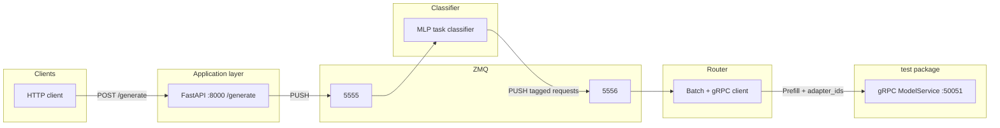
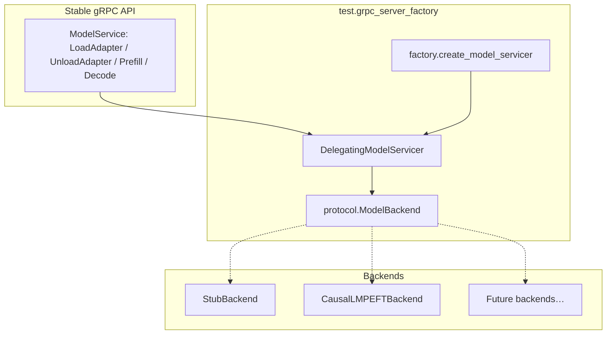

# `test/` — gRPC model factory and backends

This package provides a **pluggable gRPC `ModelService`** used by the rest of the stack. The **single process entrypoint** is `test.grpc_server_factory` (see [Run commands](#run-commands)).

---

## End-to-end pipeline (repository context)

Serving traffic flows through several processes. The **`test/`** code owns only the **rightmost** box (gRPC model server); other components live elsewhere in the repo.



**What each stage does (high level)**

| Stage | Role |
|--------|------|
| **FastAPI** | Accepts `prompt` / `max_tokens` / `temperature`, assigns `request_id`, queues JSON on **ZMQ :5555**. Returns `queued` immediately. |
| **MLP** | Classifies prompt → **`task_type`**, emits a **tagged** payload on **:5556**. |
| **Router** | Micro-batches requests, calls **`Prefill`** on the gRPC model with parallel **`adapter_ids`** (today aligned with **`task_type`**). **`Decode`** is not wired in the router yet. |
| **`test.grpc_server_factory`** | The **model server**: **`BackendKind`** selects **stub** vs **real HF + PEFT** implementation behind the same protobuf API. |

Adapter details for the PEFT path: `test/grpc_server_factory/backends/peft/PEFT_SETUP.md`.

---

## Architecture: factory pattern



| Piece | Path | Responsibility |
|--------|------|----------------|
| **Protocol** | `grpc_server_factory/protocol.py` | Structural interface: `load_adapter`, `unload_adapter`, `prefill`, `decode` (protobuf in/out). |
| **Servicer** | `grpc_server_factory/servicer.py` | `DelegatingModelServicer` — forwards each RPC to a **`ModelBackend`** instance. |
| **Factory** | `grpc_server_factory/factory.py` | **`BackendKind`** enum + **`create_model_servicer(kind, base_model_id=…)`** — constructs the right backend and wraps it in the servicer. Heavy backends are **lazy-imported** so `stub` does not require torch/peft. |
| **Backends** | `grpc_server_factory/backends/` | Concrete implementations. |

**Why a factory:** one **gRPC surface** (`model_service.proto`), many **engines** (fake stub for CI/pipeline tests, HF+PEFT for real inference). Adding a new model family = new backend module + one enum branch — no duplicate gRPC boilerplate.

---

## Backend kinds (“model types”)

| `--kind` | Module | What it does |
|----------|--------|----------------|
| **`stub`** | `backends/stub.py` | No torch. Validates `Prefill` lengths (including **`adapter_ids`**), returns canned responses. For integration tests and bring-up without GPUs. |
| **`causal_lm_peft`** | `backends/peft/causal_lm_backend.py` | Loads one **HF causal LM** + **PEFT adapters from disk** (`LoadAdapter`). Real **`Prefill` / `Decode`** with KV cache, greedy decoding, metrics. Requires `test/requirements-peft.txt`. |

---

## Run commands

**Single entrypoint** (either form):

```bash
python -m test.grpc_server_factory [args…]
python -m test.grpc_server_factory.factory [args…]
```

### Stub (no ML deps beyond grpc)

```bash
python -m test.grpc_server_factory --kind stub --bind "[::]:50051"
# or rely on default kind=stub and only set port:
python -m test.grpc_server_factory --port 50051
```

### Causal LM + PEFT (real model)

Requires: `pip install -r test/requirements-peft.txt`

```bash
export BASE_MODEL_ID="your-org/your-causal-lm"
python -m test.grpc_server_factory \
  --kind causal_lm_peft \
  --base-model-id "$BASE_MODEL_ID" \
  --bind "[::]:50051"
```

Listen address resolution: **`--bind`** if set; else env **`GRPC_BIND`**; else **`[::]:${PORT}`** (default **50051**).

---

## Adding a new backend (new “model type”)

1. **Implement `ModelBackend`** in `grpc_server_factory/protocol.py` — four methods returning the correct protobuf messages (see `StubBackend` as a template).

2. **Add a file** under `grpc_server_factory/backends/`, e.g. `my_backend.py`, with your class.

3. **Register in the factory** (`factory.py`):
   - Add a member to **`BackendKind`** (e.g. `MY_BACKEND = "my_backend"`).
   - In **`create_model_servicer`**, add `elif kind == BackendKind.MY_BACKEND:` that constructs your class (**lazy-import** inside the branch if dependencies are heavy).
   - Add the new value to argparse **`choices`** in **`main()`** (or derive choices from `BackendKind` as today).

4. **Update** this README table under [Backend kinds](#backend-kinds).

5. **Downstream:** `model_logic/model_endpoint/grpc_client.py` and the **router** already speak the same proto; only behavior inside the new backend changes unless you need new RPC fields (then change **`model_service.proto`** and regenerate stubs).

---

## Proto and stub regeneration

Canonical definition: `model_logic/protos/model_service.proto` (`PrefillRequest` includes **`adapter_ids`**).

From the **repository root**:

```bash
python -m grpc_tools.protoc \
  -I. \
  --python_out=. \
  --grpc_python_out=. \
  model_logic/protos/model_service.proto
```

---

## Dependencies

| Goal | Install |
|------|---------|
| Stub / gRPC only | `grpcio` (and `grpcio-tools` if you regenerate protos) |
| PEFT backend | `pip install -r test/requirements-peft.txt` |

---

## Minimal Python client (direct to gRPC)

Greedy loop: **`LoadAdapter`** → **`Prefill`** (with **`adapter_ids`**) → **`Decode`** until all finished.

```python
import grpc
from model_logic.protos import model_service_pb2, model_service_pb2_grpc

TARGET = "localhost:50051"


def main():
    channel = grpc.insecure_channel(TARGET)
    stub = model_service_pb2_grpc.ModelServiceStub(channel)

    stub.LoadAdapter(
        model_service_pb2.LoadAdapterRequest(
            adapter_id="task_a",
            adapter_path="/path/to/peft/adapter",
            rank=8,
            alpha=16.0,
        )
    )

    batch_id = "b1"
    pre = stub.Prefill(
        model_service_pb2.PrefillRequest(
            batch_id=batch_id,
            request_ids=["r1"],
            prompts=["Hello"],
            max_tokens=[32],
            adapter_ids=["task_a"],
        )
    )
    assert pre.status == "accepted", pre.message

    while True:
        dec = stub.Decode(model_service_pb2.DecodeRequest(batch_id=batch_id))
        if not dec.request_ids:
            break
        if all(dec.is_finished):
            print(dec.generated_texts)
            break


if __name__ == "__main__":
    main()
```

---

## Semantics (generation)

- **`Decode` `generated_texts`**: full string so far (prompt + completion), `skip_special_tokens=True`.
- **Multi-adapter batches**: prefill groups by **`adapter_id`**; decode does **one forward per request per RPC** (not fused across rows).
- **Greedy**: argmax each step.

---

## PEFT backend and metrics

- Implementation: `grpc_server_factory/backends/peft/` (`CausalLMPEFTBackend`, `ServingMetrics`).
- Setup and checkpoints: **`backends/peft/PEFT_SETUP.md`**.

After each completed request, a line like  
`[metrics] completed=… throughput_global=… throughput_60s_window=… latency_mean=… first_token_latency_mean=… | last: …`  
is printed (also via `logging`).

- **Latency**: start of prefill → completion for that request.
- **First-token latency**: start of prefill → first generated token committed (if `max_tokens` is 0, equals prefill-only duration).
